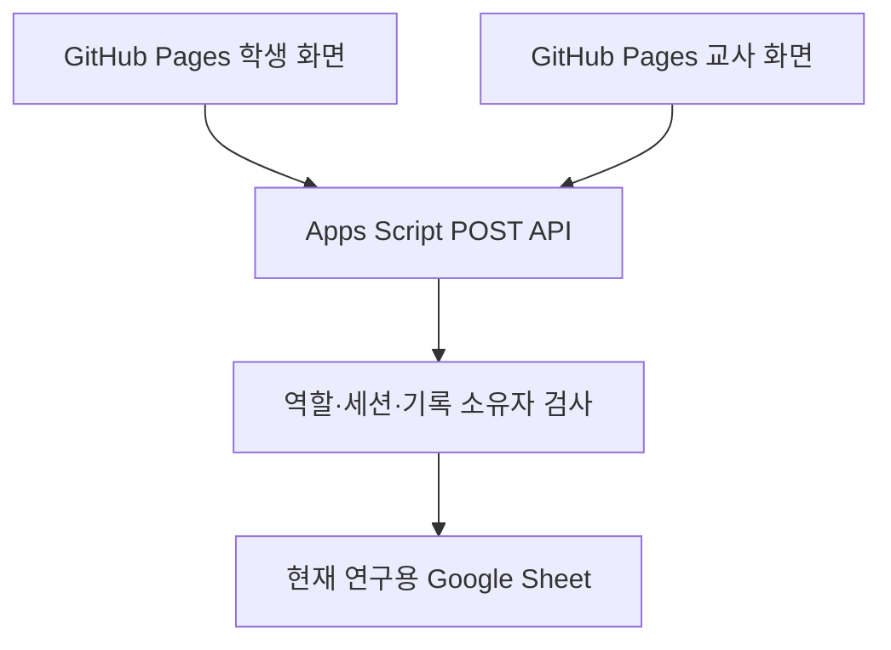

# 연구용 카페인·수면 기록 앱 연결 설계

작성: 2026-09-28 · 상태: 검토 초안

## 목적과 확정된 요구

- 학생은 공개 GitHub Pages 주소에서 바로 화면을 열고 **학번과 이름**으로 로그인한다. 학교 Google 계정은 요구하지 않는다.
- 교사는 Google 계정 대신 **교사용 비밀번호**로 대시보드에 접속한다.
- 학생과 교사가 쓰는 데이터는 현재 연구용 시트 `18FCQuPoI90ixaN0dQdTd2Q35oniZ30_xzUNs9ZptUV4`에 저장한다. 옛 `caffeine-sleep-diary` 시트와 혼동하지 않는다.
- 10차시 수업의 7일 라이프로깅, 자기 데이터 확인, 후속 재측정 흐름을 유지한다. 연구 자료에 적힌 학부모 동의와 개인정보 안내는 배포 전 교사가 준비한다.

## 확인된 현황

- 학생 화면은 `student-frontend` 브랜치에 있고, GitHub Pages의 `main`은 아직 Apps Script로 이동하는 임시 페이지다.
- 브라우저에서 Apps Script의 GET과 `text/plain` JSON POST 응답을 읽는 통신을 확인했다. POST 점검은 `testConnection`이 화이트리스트에 없어 오류 응답을 받았으며, 전송 자체는 성공했다.
- 현 서버의 GET/POST 화이트리스트에 교사용 전체 자료 함수가 포함되어 있다. 학생 조회는 임의의 학번을 받으며, 기록 수정·삭제는 기록 ID만으로 실행된다. 이 상태로 학생 페이지를 공개하지 않는다.
- GitHub의 학생용 브리지는 POST를 사용한다. 서버 POST 화이트리스트에는 학생 화면이 호출하는 `getFilteredStats`, `generateAIHealthReport`, `analyzeDrinkImageWithAI`가 빠져 있어 기능별 정합성 점검이 필요하다.

## 선택한 구조

현재 시트에 묶인 Apps Script 프로젝트를 단일 데이터 API로 사용한다. 배포된 `/exec` 주소는 유지할 수 있지만, 새 버전의 `doGet`은 기존 HTML과 GET API를 더 이상 제공하지 않는다. GitHub에는 학생 화면과 별도의 교사 화면을 둔다. 모든 데이터 요청은 POST 본문으로 보내며, 비밀번호와 세션을 URL에 넣지 않는다. HTML을 Apps Script에서 계속 제공하면 `google.script.run`으로 서버 함수를 직접 부를 수 있으므로 공개 배포에서 제거한다. 다른 활성 배포도 같은 우회 경로를 제공하는지 확인한다.

대안 검토:

| 방식 | 판단 |
|---|---|
| 기존 Apps Script를 API 전용으로 바꾸고 GitHub에 두 화면 배치 | 현재 시트 연결과 기존 화면을 재사용할 수 있어 채택 |
| 새 Apps Script 프로젝트만 추가 | 기존 공개 배포의 교사용 함수 노출을 해결하지 못함 |
| GitHub에서 Sheets API 직접 호출 | 쓰기 권한을 위한 비밀을 공개 페이지에 둘 수 없어 제외 |

## 인증과 권한

1. `checkLogin(학번, 이름)`이 시트 명단과 일치하면 서버가 임의 세션 토큰을 발급한다. 서버 캐시에 토큰과 **정규화된 학생 ID**를 연결하고 만료 시간을 둔다. 브리지는 토큰을 POST 본문에 첨부한다. 새로고침 뒤 세션 복구 시에는 서버에서 유효성을 다시 확인한다.
2. 학생 작업은 토큰의 학생 ID와 요청의 ID 또는 저장 payload의 ID가 일치해야 한다. 조회·통계·문의·메시지에도 같은 규칙을 적용한다. 기록 ID 또는 행 번호로 수정·삭제·읽음 처리를 할 때는 해당 시트 행의 소유자를 서버에서 확인한다. 없는 소유자 정보는 거부하고 로그에 개인정보를 남기지 않는다.
3. `teacherLogin(비밀번호)`은 Apps Script의 비공개 Script Properties에 저장된 검증값과 비교하고, 짧게 만료되는 교사 세션을 발급한다. 교사용 모든 읽기·쓰기 action은 이 세션을 요구한다. 비밀번호는 GitHub 코드·시트·URL에 넣지 않는다. 연속 실패에 제한을 둔다.
4. 공개 상태에서 허용할 요청은 연결 상태처럼 개인정보를 반환하지 않는 작업으로 한정한다. API는 역할별 명시적 화이트리스트를 사용하고 알 수 없는 action을 거부한다.
5. **한계:** 학번과 이름을 아는 사람은 다른 학생으로 처음 로그인할 수 있다. 세션 소유자 검사는 로그인 후 파라미터 변경을 막지만 이 사칭 위험을 없애지는 못한다. 학생별 비밀 코드 없이 이를 완전히 해결했다고 설명하지 않는다.

## 화면과 데이터 처리

- 학생 화면의 기존 입력·대시보드·수정·삭제를 유지한다. 세션 만료 시 다시 학번과 이름을 받는다. 이미지 분석 및 AI 기능은 본문 크기, 서버 화이트리스트, 외부 API 설정을 따로 검증한 뒤 켠다.
- 교사 화면은 첫 진입 시 비밀번호 입력 화면을 보여 준다. 인증 성공 전에는 전체 명단이나 기록 요청을 실행하지 않는다. 로그아웃은 브라우저 토큰과 서버 세션을 무효화한다.
- Apps Script 요청 진입점에서 현재 시트 ID를 검증하여 옛 시트에 쓰지 않게 한다. 기존 시트 열 구조는 보존한다.
- 공개 GitHub 저장소에는 학생 데이터, 교사 비밀번호, 외부 AI API 키를 넣지 않는다.

## 구현 순서와 검증

1. 현재 Apps Script 코드와 배포 버전을 백업하고, 학생·교사 화면이 호출하는 action 및 시트 소유자 열을 표로 확정한다.
2. 서버의 API 진입점, 학생 세션, 교사 비밀번호 세션, 역할별 action, 소유자 검사를 작은 단위로 작성하고 단위 테스트한다.
3. 학생 브리지와 교사 화면을 세션 흐름에 맞게 고치고, 민감한 요청이 GET URL에 남지 않는지 확인한다.
4. 테스트 계정으로 로그인, 자기 기록 저장·조회·수정·삭제, 타인 ID/기록 ID 거부, 교사 비밀번호 실패·성공, 만료, 로그아웃을 검증한다. 실제 학생 자료를 테스트로 수정하거나 삭제하지 않는다.
5. 교사가 Apps Script에 비밀번호를 직접 설정한 뒤 배포 버전을 갱신한다. 이전 활성 배포의 공개 HTML/RPC 경로를 점검한다. 마지막으로 GitHub Pages의 `main`을 학생 화면으로 바꾸고 새 주소에서 검증한다.

## 배포 조건

교사 비밀번호 설정, 타인 기록 접근 거부, 교사 API 무인증 거부, 현재 시트 ID 확인, 학생 주요 기능 검증이 끝나기 전에는 `main`에 학생 화면을 병합하거나 URL을 학생에게 배포하지 않는다. 학번·이름 방식의 사칭 위험과 연구 동의 안내는 교사가 학생 배포 전에 확인한다.
